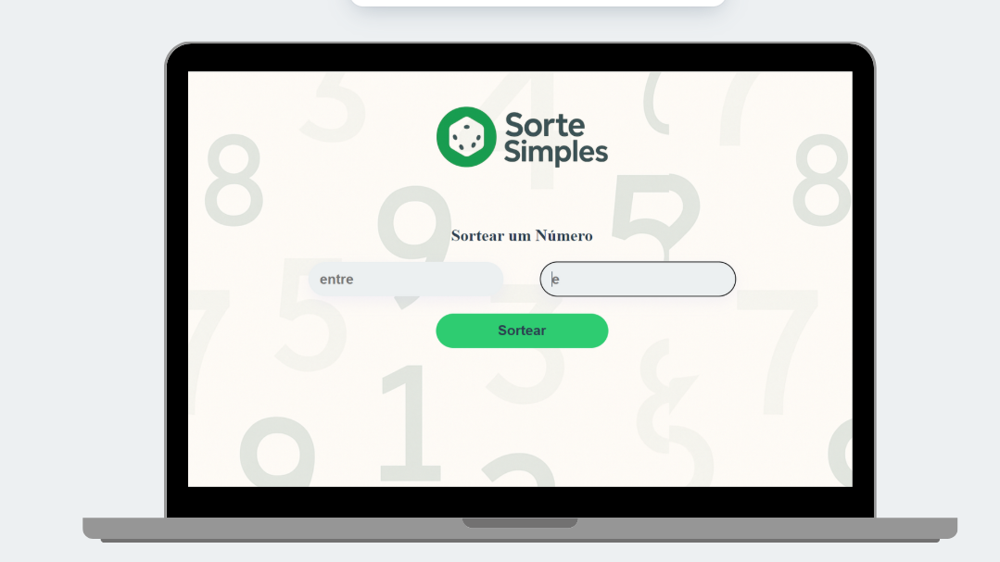

# 🎲 SorteSimples

**SorteSimples** é um aplicativo minimalista de sorteador de números aleatórios, desenvolvido com **HTML**, **CSS** e **JavaScript**.
Ideal para sorteios simples, como rifas, jogos ou decisões rápidas do dia a dia.

---

## 🚀 Funcionalidades

- Geração de números aleatórios dentro de um intervalo definido.
- Interface responsiva e intuitiva.
- Design minimalista e moderno.
- Botão de “Sortear” com animação leve.
- Totalmente funcional sem conexão com servidor.

---

## 📸 Captura de Tela



---

## 🛠️ Tecnologias

- Visual Studio Code – (Ambiente de desenvolvimento)
- HTML5
- CSS3
- JavaScript (ES6)

---

## 🌐 Publicação

Você pode acessar a aplicação funcionando em:  
👉 [https://JardsonFlorentino.github.io/SorteSimples](https://JardsonFlorentino.github.io/SorteSimples)

---

## 📁 Como Usar Localmente

1. Clone este repositório:

  ```bash
   git clone https://github.com/JardsonFlorentino/SorteSimples


Abra o arquivo index.html no seu navegador.

## 📁 Estrutura de Pastas

```bash
├── index.html
├── style.css
├── script.js
├── assets/
│ ├── preview.jpg
│ └── icons, flags etc.
```


📌 Observações

Este projeto foi feito com fins educacionais.

🙋‍♂️ Autor
Desenvolvido por Jardson

[Meu LinkedIn](https://www.linkedin.com/in/jardsonflorentino) | [Meu GitHub](https://github.com/JardsonFlorentino)
